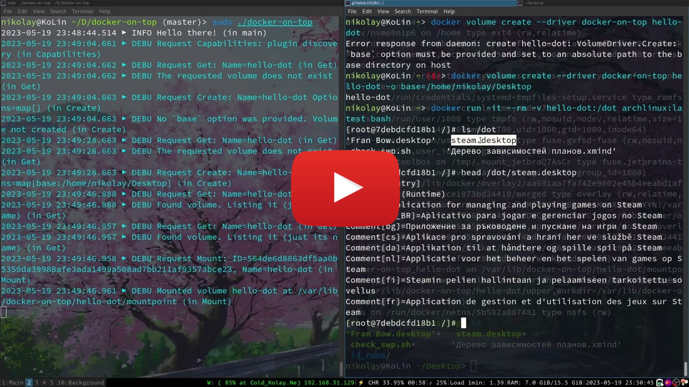

# Docker-On-Top

Docker volume driver that implements **bind-like mounts** that use **copy-on-write**:
the containers can write to the mounted volume and the changes are seen by all containers
using a volume, but the base host directory remains unchanged.

## Usage

After starting the plugin (using one of the methods described below), one can create
volumes and mount them to containers like this:
```shell
docker volume create --driver docker-on-top VolumeName -o base=/path/to/host/directory/
docker run -v VolumeName:/where/to/mount image:tag
```

There's also a video demonstration of how plugin works. It is somewhat outdated in terms
of the feature set but demonstrates the concept:

<a href="https://youtu.be/tuk7p5kxliQ">
    
</a>

## Limitations

-   Docker-on-top requires a UNIX-like operating system with a kernel that provides the
    `overlay` filesystem (for example, Linux).

-   Docker-on-top is based on the
    [`overlay` filesystem](https://www.kernel.org/doc/html/latest/filesystems/overlayfs.html),
    so it inherits all the limitations of that filesystems, which include peculiarities
    with hard links behavior and some other stuff but, most importantly, **changes to the
    base directory are not allowed while a volume is mounted**: if it happens, quoting the
    documentation, "the behavior of the overlay is undefined, though it will not result in
    a crash or deadlock".
    
    While a volume is unmounted (all containers using a volume are stopped or terminated),
    changes in the volume's base directory are allowed.

-   Docker-on-top uses the `flock` system call to synchronize access inside its internal
    directory (aka "dot root directory"): `/var/lib/docker-on-top/`. Thus, the filesystem
    where your `/var/lib/` is located must support `flock`. If you don't know what that is,
    then your filesystem most likely support it 🙂

## Build

To build the plugin, go to the project directory and simply run `go build`.

### Run

The simplest way to run the plugin after it's built is to do
```shell
sudo ./docker-on-top
```

Simple as that! The plugin will create a socket and on the next volume-related command
the docker daemon will automatically discover the new plugin.

### Run as a systemd service

It might be more convenient to manage the plugin as a systemd service (it also allows
to automatically start the plugin together with the docker daemon). To enable this,
run the following commands after building the plugin:
```shell
sudo cp ./docker-on-top /usr/local/bin/  # Put the executable to the system-wide accessible directory
sudo cp ./docker-on-top.service /etc/systemd/system/  # Create the service file for systemd
sudo systemctl enable docker-on-top.service  # If you want the plugin to be automatically started with docker
```

That's it. After these actions you can manage the plugin as a systemd service with
commands like `systemctl start`, `systemctl stop`, etc.

## Volatile volumes

(note: volatile volumes have nothing to do with overlayfs's "volatile mount")

Volatile volume, just like the usual one, keeps the changes visible to all the
containers using it at the same time but, _unlike_ the usual ones,
**discards the changes made to it** after the last container using the volume
is unmounted. Here's an example:

```
$ # First, use a usual (non-volatile) volume
$ docker volume create --driver docker-on-top usual-volume -o base=/
usual-volume
$ docker run -it --rm -v usual-volume:/dot ubuntu:22.04 bash
root@16762a8ddc71:/# echo 123 > /dot/f
root@16762a8ddc71:/# cat /dot/f
123
root@16762a8ddc71:/# exit
exit
$ docker run -it --rm -v usual-volume:/dot ubuntu:22.04 bash
root@ca7380aa393c:/# cat /dot/f  # Non-volatile volume - changes are preserved on container restart
123
root@ca7380aa393c:/# exit
exit
$ 
$ 
$ # Now, try a volatile volume
$ docker volume create --driver docker-on-top volatile-volume -o base=/ -o volatile=true
volatile-volume
$ docker run -it --rm -v volatile-volume:/dot ubuntu:22.04 bash
root@8cc600cd877f:/# echo 123 > /dot/f
root@8cc600cd877f:/# cat /dot/f
123
root@8cc600cd877f:/# exit
exit
$ docker run -it --rm -v volatile-volume:/dot ubuntu:22.04 bash
root@d4a6d78f5664:/# cat /dot/f  # Volatile volume - changes were discarded when the previous container exited
cat: /dot/f: No such file or directory
root@d4a6d78f5664:/# exit
exit
$
```

Note that not only exiting a container, but also **stopping** it currently results
in the **changes discard** (unless another container is using the volume). This
behavior _may_ be subject to change.

**To avoid accidental data losses**, it is recommended to indicate the volume's volatility
in its name: when creating a volatile volume, name it accordingly, for instance, add
the `-volatile` suffix for all volatile volumes.

### Technical note

_Logically_, the changes to a volatile volume only exist while there is at least one
container using it. However, the changes are _physically_ discarded not when the last
container using the volume exits, but when after that a _new_ container is created and
wants to use the volume.

Thus, if you messed up with your volatile volumes, you can still recover
changes made to a volume before it is mounted to a new container. The modified
files can be found in `/var/lib/docker-on-top/<volume name>/upper/`.
